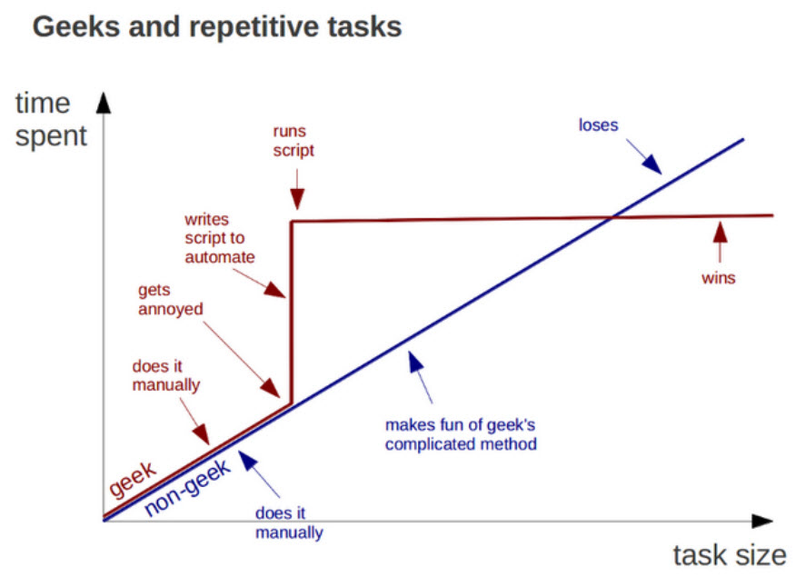
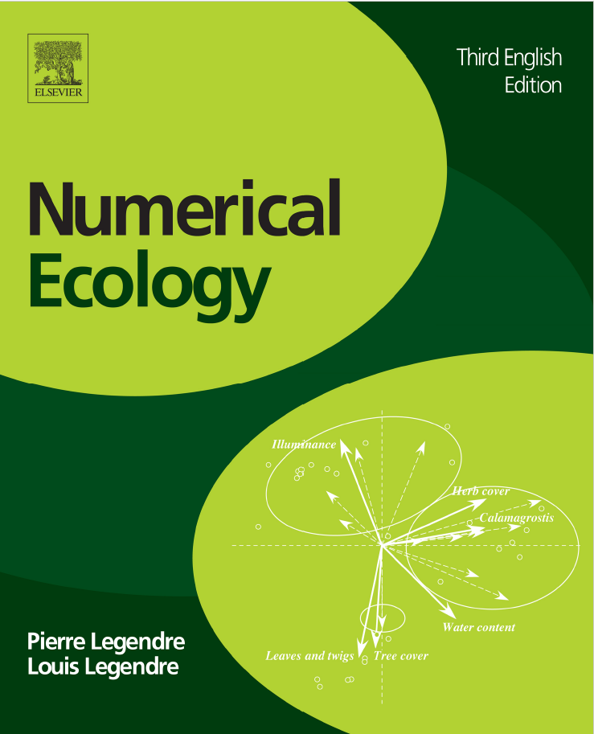
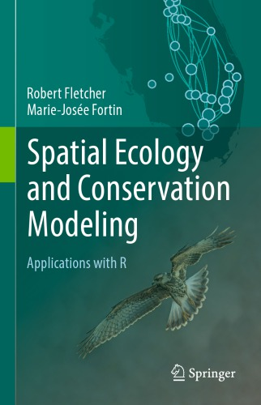
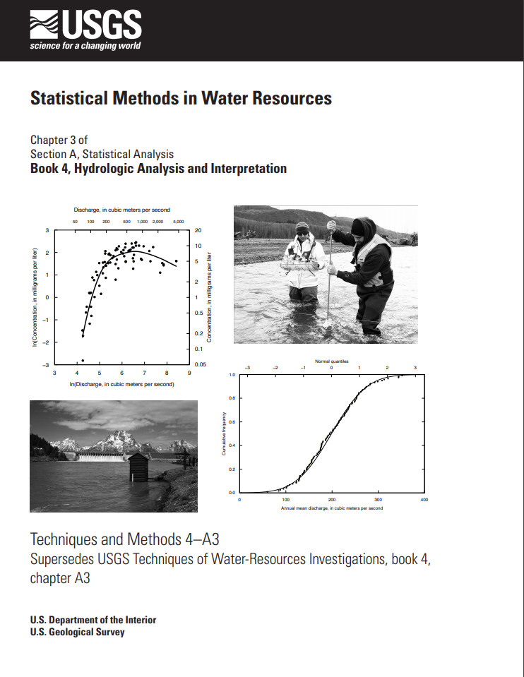
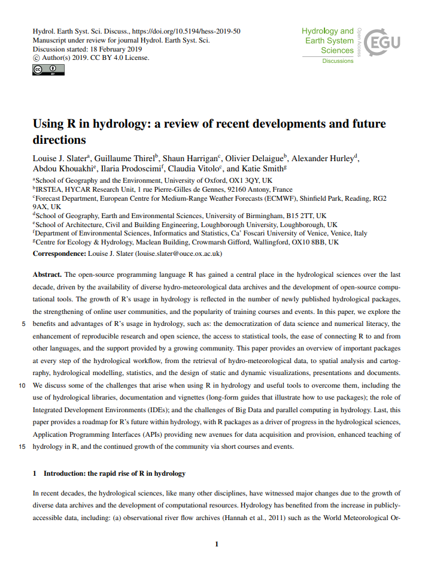
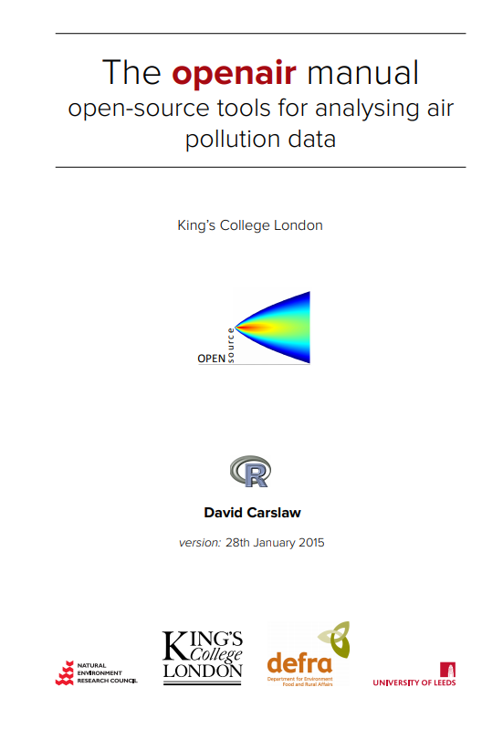
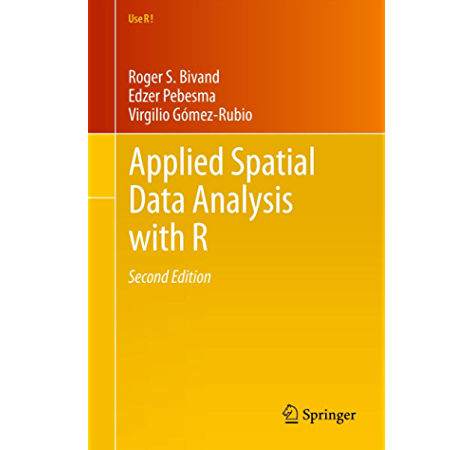

class: center, middle

# Un poco de panorama


---

# Tipos de uso

El uso de **R** es conveniente porque puede ser usado para tareas generalistas como para tareas de especialidad  (biología y medio ambiente)

.pull-left[
**Generalista**

- Enfocado a la experiencia en el manejo de R 

- Ordenamiento de datos

- Exploración de datos

- Generación de gráficos

- Generación de reportes

- Automatización
]
.pull-right[
**Especialista**

- Requiere validación de un profesional 

- Modelos estadísticos

- [Análisis espaciales](https://cran.r-project.org/web/views/Spatial.html)

- [Análisis espaciotemporales](https://cran.r-project.org/web/views/SpatioTemporal.html)

- [Evaluaciones de biodiversidad](https://cran.r-project.org/web/views/Environmetrics.html)

- [Modelamiento hidrológico](https://cran.r-project.org/web/views/Hydrology.html)

]


---
class: inverse, center, middle

# Empecemos por aplicaciones generalistas<sup>1</sup>

.footnote[
<sup>1</sup> AKA data science, en esta ocasión.]

---

class: center
# ¿Cuándo programar?




---
class: center, middle
# El proceso de data science


La ciencia de datos es la disciplina encargada de transformar datos crudos en conocimiento.

---
class: center, middle

# Tip 1: Empiecen por tidyverse.

---

class: center, middle
background-image: url(hex_tidyverse.svg)
background-size: contain

---
# El tidyverse y los recursos

.pull-left[
<a href="https://www.tidyverse.org/">
  
</a>
<br>
<br>

 Conjunto de paquetes orientados para el manejo y transformación de datos que comparten **filosofía de diseño**, **gramática** y **estructura de datos**.

]

.pull-right[
<center>
<a href="http://gen.lib.rus.ec/book/index.php?md5=D2959053C56450FF841B133AE038A16D">
  
</a>
</center>
- R for Data Science. [[EN]](https://r4ds.had.co.nz/) [[ES]](https://es.r4ds.hadley.nz/)
- [Cheatsheets](https://rstudio.com/resources/cheatsheets/).
- Comunidad R:
  - [useR!](https://www.youtube.com/channel/UC_R5smHVXRYGhZYDJsnXTwg/featured).
  - Stack Overflow.
  - [#rstats](https://twitter.com/search?q=%2523rstats).
  - [#TidyTuesday](https://github.com/rfordatascience/tidytuesday).
  - [RLadies](https://rladies.org/).
- **Google**.
- ?
]
---
class: center, middle

# Tip 2: ¡Ordenen sus datos!

.footnote[
[Wickham (2014). Tidy data. _Journal of Statistical Software_, <b>59 </b>(10), 1-23.](http://dx.doi.org/10.18637/jss.v059.i10)
]

---
class: center, middle

# Tip 3: Usen pipes para la manipulación de datasets.

### [¿Tuberías?](https://othomantegazza.github.io/eda-class/slides/02-intro-to-tidyverse.html)

---
class: inverse, center, middle

# Sigamos con las aplicaciones de especialistas<sup>1</sup>

.footnote[
<sup>1</sup> O sea, ustedes.]

---

class: center, middle

# Tip 4: Usen los [CRAN Task View](https://cran.r-project.org/web/views/).

---
class: center, middle
background-image: url('Cran task view.png')
background-size: contain
---

class: center, middle

# Tip 5: Busquen bibliografía especializada.

.footnote[
La mayoría son libres. Sino, [Library Genesis](http://gen.lib.rus.ec/).]
---
.pull-left[
## Ecología
<center>
.column[
<a href='http://gen.lib.rus.ec/book/index.php?md5=A3F1BD1017AED3F423C7270ED278F43B'>

</a>
<a href='http://gen.lib.rus.ec/book/index.php?md5=A0DA422B517A1D0C45F65137FBD2BE94'>

</a>
]
</center>

- R es [**muy popular**](https://doi.org/10.1002/ecs2.2567) en ecología.
- Ecología numérica por Pierre Legendre:
  - [Libro práctico](http://gen.lib.rus.ec/book/index.php?md5=5FD3692B89EF55A90EBDBCCC44168176) en R con [scripts](http://adn.biol.umontreal.ca/~numericalecology/numecolR/).
  - [Curso](http://adn.biol.umontreal.ca/~numericalecology/Trieste16/) grabado, publicado en [YouTube](https://www.youtube.com/playlist?list=PLos1JqOLJm3soC42-SV-zyLT9WEFi4Qji).
  - [Notas del curso](http://biol09.biol.umontreal.ca/Trieste16/).
- Ecología espacial por Marie-Jose Fortin.
]

.pull-right[
## Agua
<center>
.column[
<a href='https://pubs.usgs.gov/tm/04/a03/tm4a3.pdf'>

</a>
<a href='https://hess.copernicus.org/preprints/hess-2019-50/hess-2019-50.pdf'>

</a>
]
</center>
- Recomendado por la USGS para análisis estadísticos<sup>*</sup>.
- Herramientas de [homogenización de datos climáticos](https://cran.r-project.org/web/packages/climatol/index.html).
- Paquetes para rápido análisis hidrográficos.
- Algunos modelos físicos implementados en R (topmodel, WASIM, SWC).

]

---
class: center, middle

# Tip 6: Preguntas especializadas pueden hacerlas a través de mailing lists. 

.footnote[
Por ahora, solo están disponibles listas para [ecología](https://stat.ethz.ch/mailman/listinfo/r-sig-ecology) y [geografía](https://stat.ethz.ch/mailman/listinfo/r-sig-geo).]
---
.pull-left[
## Aire
<center>
<a href='http://www.openair-project.org/PDF/OpenAir_Manual.pdf'>

</a>

</center>
- Paquete principal: OpenAir por David Carslaw.
- Diseñado para hacer análisis avanzado de datos de estaciones automáticas (meteorología y calidad de aire).
- Retrotrayectorias disponibles.
- Mudando a [tidyverse](https://bookdown.org/david_carslaw/openair/).
]

.pull-right[
## Espacial
<center>
<a href='http://gen.lib.rus.ec/book/index.php?md5=AE027C1EB5D0D3B72C8FAC3897CD3776'>

</a>
</center>
- Edzer Pebesma y Roger Bivand.
- Todos los años hay una escuela de verano en Europa: [OpenGeoHub](https://www.opengeohub.org/).
- Muchas de las conferencias de OpenGeoHub están disponibles en [Youtube](https://www.youtube.com/c/OpenGeoHubFoundation).

]


---
class: center, middle

# Tip 7: Aprender con un objetivo concreto es más efectivo que aprender aleatoriamente. 

---
background-image: url(hackathons.png)
background-size: contain
class: center, middle

---
class: center, middle

# Tip 8: Los códigos deben ser entendibles y reproducibles. 

---
class: center, middle

# Tip 9: Aprovechen las funcionalidades de R.

---
```{r out.width='100%', fig.height=6, eval=require('leaflet')}
library(leaflet)
leaflet() %>% addTiles() %>% setView(-76.987, -12.11, zoom = 17) %>%
  addMarkers(-76.9870163,-12.1105517,popup="INSIDEO")
```

---

class: center, middle

# R en consultoría ambiental
Diapositivas realizadas en [**xaringan**](https://bookdown.org/yihui/rmarkdown/xaringan.html).


